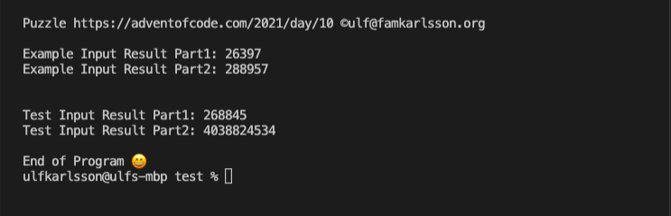
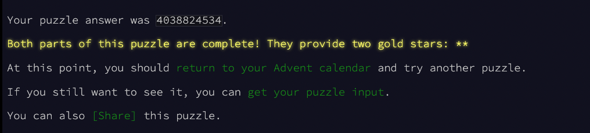

# My simple C++ solution for AoC2021-Day 10

## How to run this code

- My setup: MB Pro M1Pro - macOS 12.0

- Open folder in VS Code
- Added C/C++ extension (plus maybe some more...)
- Added CodeLLDB extension for launching/debugging
- Launch launch.json

## My results

### When launching code - terminal output:

### Success from AoC page:

